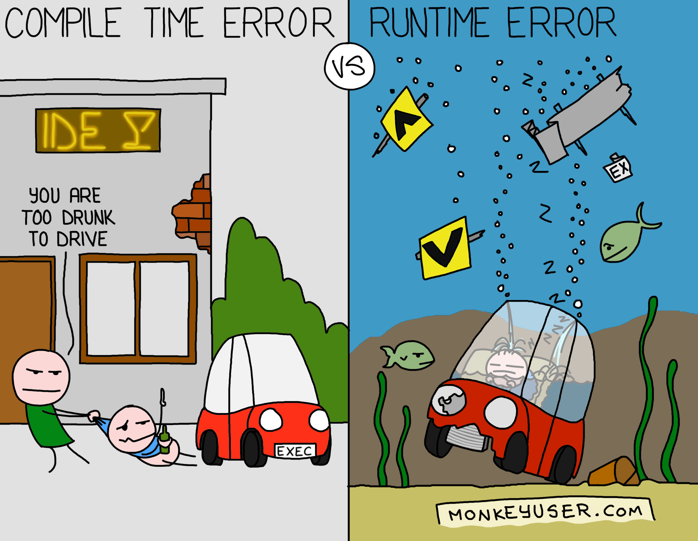

# Command enters our system

```scala
case class AddNewProduct(
  sku: String, 
  name: String, 
  categories: List[String], 
  brands: List[String]
)
```
---

# Several modules later

```scala
  case class UpdateCountOf(
    skus: Set[String], 
    categories: Set[String], 
    brands: Set[String]
  )
```
---

# Maybe take a look at test fixtures

---

```scala
val updateCountOfFixture = UpdateCountOf(
  Set("name"),
  Set("category1", "cateogry2"),
  Set("brand")
)
```
---

# Whan can be done

```scala
  class ProductName(val value: String) extends AnyVal
  class CategoryId(val value: String) extends AnyVal
  class BrandId(val value: String) extends AnyVal
  class Sku(val value: String) extends AnyVal


  val skuFromJson: String = "sku"
  val domainSku: Sku = new Sku(skuFromJson)
``` 

---
# Value classes

* small wrappers with only one constructor
* they are there only during compilation time - **erased after!** but not always :(
* allocation is needed if:
  * a value class is treated as another type (ex. Serializable) [^1]
  * a value class is assigned to an array. [^1]
  * doing runtime type tests, such as pattern matching or `isInstanceOf` [^1]

[^1]: https://docs.scala-lang.org/overviews/core/value-classes.html
---


# Cool side effect
```scala
val productName = new ProductName("product")
val categoryName = new CategoryId("12345")

productName == categoryName

// compilation result with `"-Xfatal-warnings"`
ProductName and CategoryId are unrelated: 
they will never compare equal
[error]   productName == categoryName
[error]               ^
[error] one error found
[error] (Compile / compileIncremental) Compilation failed
```

---

# New add new product command

```scala
case class AddNewProduct(
                             sku: Sku, 
                             name: ProductName, 
                             categories: List[CategoryName], 
                             brands: List[BrandName]
                           )
```
---

# Usage

```scala
case class UpdateCountOf(
  skus: Set[Sku], 
  categories: Set[CategoryId],
  brands: Set[BrandId]
)
```

---
class: center, middle
# Clear expectations - types
---

# Elastic search batch api

```scala
val resp = client.execute {
  bulk (
    index into "products" fields product1.toJson,
    index into "products" fields product2.toJson
  )
}
```
---

# Some transformations and write after

```scala
  val indexables =
    someProducts
    .map(getSomeExternalData)
    .collect(selectOnlySuccessfulCalls)
    .map(buildIndexableOperation)

  val resp = client.execute {
    bulk (
      indexables
    )
  }
```  

---

```
Failed to derive xcontent from org.elasticsearch.common.bytes.BytesArray@1
```

???

Czy ktos wie co sie dzieje? A to po prostu pusty bulk
---
# How to solve it?

```scala
def bulk(list: NonEmptyList[Indexable])

val resp = indexables match {
  case List() => Future.successful(Done)
  case head :: tail =>
    client.execute {
      bulk (
        NonEmptyList(head, tail)
      )
    }
}
```
???

Tutaj trzeba opowiedziec ze mimo ze kod jest troche dluzszy to od razu wiadomo co sie dzieje
---
class: center, middle


???

Chwila na śmiech
---
class: center, middle
# Clear expectations - refined types
---

# Indexable category
```scala
  case class IndexableCategory(
                                id: CategoryId,
                                name: CategoryName,
                                url: String,
                                boost: Double,
                              )
```
---

# Indexable category with value classes
```scala
  class CategoryBoost(val value: Double) extends AnyVal
  class CategoryUrl(val value: String) extends AnyVal

  case class IndexableCategory(
                                id: CategoryId,
                                name: CategoryName,
                                url: CategoryUrl,
                                boost: CategoryBoost,
                              )
```

---
# Refined non empty

```scala
case class CategoryName(val value: String Refined NonEmpty)

val emptyName = new CategoryName("")

// generates following compilation error
Predicate isEmpty() did not fail.
[error]   val emptyName = new CategoryName("")


val refined: Either[String, String Refined NonEmpty] 
  = refineV[NonEmpty](stringFromUsrInput)
```

???

Zwrócić uwagę ze juz niestety nie any val :( I case class bo equals

---
# Refined url

```scala
case class CategoryUrl(val value: String Refined Url)

new CategoryUrl("example.com")
// Url predicate failed: no protocol: example.com

new CategoryUrl("htt://example.com")
// Url predicate failed: unknown protocol: htt
```  

???

Zwrócić uwage na te konkretne bledy kompilacji

---

# Refined positive

```scala
case class CategoryBoost(val value: Double Refined Positive)

new CategoryBoost(-1.0)
//Predicate failed: (-1.0 > 0.0).
```

